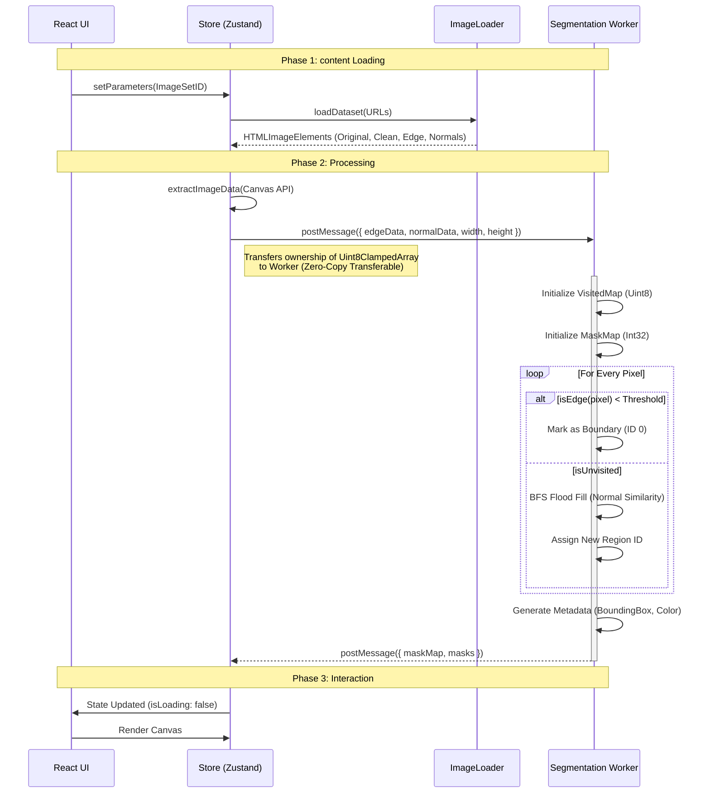

# Architecture Documentation

## 1. System Overview

**ColorCraft** is a high-performance, client-side React application designed for real-time architectural visualization. It enables users to interactively segment and colorize building facades using a hybrid computer vision algorithm running locally in the browser.

### High-Level Components
- **Presentation Layer**: React (Vite) + CSS Variables for theming.
- **State Layer**: Zustand (Store) for high-frequency state updates without prop drilling.
- **Compute Layer**: Web Workers for continuous, non-blocking image segmentation.
- **Rendering Layer**: HTML5 Canvas for pixel-perfect mask composition and color overlays.

---

## 2. Architectural Diagrams

### 2.1 Component Architecture (C4 Level 3)

This diagram illustrates the interaction between the React Components, the Store, and the Background Services.

```mermaid
graph TD
    subgraph "UI Layer (Main Thread)"
        App[App Root]
        Sidebar[Sidebar Control]
        Viewer[Image Viewer]
        Canvas[Canvas Overlay]
        
        App --> Sidebar
        App --> Viewer
        Viewer --> Canvas
    end

    subgraph "State Management (Zustand)"
        Store[App Store]
        State[State: ImageSet, MaskMap, Selection]
        Actions[Actions: setMaskData, selectMask]
        
        Store --> State
        Store --> Actions
    end

    subgraph "Infrastructure"
        Loader[Image Loader Service]
        WorkerBridge[Worker Interface]
    end

    subgraph "Background Thread"
        SegWorker[Segmentation Worker]
        exclude[Algorithm: Edge + Normal Fill]
    end

    %% Data Flow
    Sidebar -->|dispatch(setColor)| Actions
    Viewer -->|dispatch(setDimensions)| Actions
    Viewer -->|Generic Click Event| Actions
    
    Actions -->|Updates| State
    State -->|Re-renders| Sidebar
    State -->|Re-renders| Canvas

    %% Logic Flow
    App -->|1. Init Load| Loader
    Loader -->|2. Images (Clean, Edge, Normal)| WorkerBridge
    WorkerBridge -->|3. PostMessage (ArrayBuffers)| SegWorker
    SegWorker -->|4. Processing| SegWorker
    SegWorker -->|5. Result (MaskMap Int32Array)| WorkerBridge
    WorkerBridge -->|6. Store Update| Actions
```

### 2.2 Segmentation Data Flow

The segmentation pipeline is the critical path. It must handle ~4MB of data (for 1MP images) without freezing the UI.



---

## 3. Key Architectural Decisions & Trade-offs

### 3.1 Client-Side vs. Server-Side Processing
**Decision**: Perform all image segmentation on the client (browser).

| Approach | Pros | Cons |
|:--- |:--- |:--- |
| **Client-Side (Chosen)** | • **Privacy**: User images never leave the device.<br>• **Cost**: Zero server compute costs.<br>• **Latency**: Instant interaction after load; no network round-trips for clicks.<br>• **Offline**: Works without internet. | • **Performance**: Dependent on user's device capabilities.<br>• **Complexity**: Heavy JS/Worker logic required.<br>• **Battery**: Higher consumption on mobile. |
| **Server-Side** | • **Consistency**: Same performance everywhere.<br>• **Power**: Can use heavy GPU/ML models (Segment Anything). | • **Cost**: Expensive GPU hosting.<br>• **Latency**: Network delay on every action.<br>• **Privacy**: Requires data upload. |

**Verdict**: Given the interactive "paint" nature, low latency is critical. A delay of >100ms breaks the stored illusion of painting. Thus, **Client-Side** is the only viable option for the desired UX.

### 3.2 Web Workers for Computation
**Decision**: Offload segmentation loop to a Web Worker.

- **Problem**: The segmentation loop iterates over `Width * Height` pixels (e.g., 1,000,000 iterations). On the main thread, this would freeze the UI for 500ms-2s.
- **Solution**: Move logic to `segmentation.worker.ts`.
- **Trade-off**: Requires serialization of data between threads. We mitigate this using **Transferable Objects** (transferring ArrayBuffers instead of copying) to make data passing nearly instantaneous.

### 3.3 State Management: Zustand vs. Context API
**Decision**: Use **Zustand**.

| Feature | Zustand | React Context |
|:--- |:--- |:--- |
| **Rendering** | Selectors allow components to re-render *only* when specific slices change. | Context updates re-render *all* consumers designated consumers, often leading to wasted renders. |
| **Async Actions** | First-class support; actions can be async. | Requires `useEffect` or complex reducers. |
| **DevEx** | Simple hook-based API (`useStore`). | Boilerplate-heavy (Providers, Consumers). |

**Implication**: Since we deal with high-frequency updates (e.g., hovering over thousands of masks), unnecessary re-renders would kill performance. Zustand's selector pattern is essential here.

### 3.4 Segmentation Strategy: Heuristic vs. Machine Learning
**Decision**: Hybrid Heuristic (Edge + Normal Map) instead of Client-Side ML (e.g., ONNX/TensorFlow.js).

- **Why?**
    1.  **Reliability**: Architectural edges are geometrically defined. Normal maps provide exact surface orientation. ML models often "hallucinate" boundaries on clean walls.
    2.  **Size**: The heuristic code is ~2KB. An efficient segmentation model (SAM-Quantized) is ~10-40MB, which is too heavy for a quick web demo.
    3.  **Speed**: Heuristic runs in O(N) linear time.
- **Trade-off**: Requires pre-processed inputs (Edge/Normal maps) generated by a 3D pipeline or pre-processor, rather than working on *any* raw photo.

---

## 4. Implementation Details

### 4.1 The Mask Map (`Int32Array`)
To handle up to millions of pixels and potentially 65k+ regions:
- We do **not** use objects for pixels.
- We use a flat `Int32Array` of size `Width * Height`.
- `maskMap[i]` stores the **Region ID** for pixel `i`.
- **Memory Usage**: 1MP Image = ~4MB. This is extremely efficient compared to object-based storage.

### 4.2 Handling "Sketch Style" Edge Maps
During development, we encountered edge maps with white backgrounds (value 255) and dark lines (value 0).
- **Standard Logic**: `if (pixel > threshold) Edge`.
- **Sketch Logic**: `if (pixel < threshold) Edge`.
- **Solution**: The worker implements the **Sketch Logic** (`< 200`), effectively treating the white background as "free space" and dark lines as "walls".

### 4.3 Coordinate Systems
Canvas and Mouse events use different coordinate spaces.
- **Mouse**: Viewport Coordinates (need `getBoundingClientRect`).
- **Canvas**: Internal Resolution (often scaled by `window.devicePixelRatio`).
- **Logic**: We map `ClientX/Y` -> `CanvasX/Y` -> `DataIndex` to ensure clicks map exactly to the underlying segmentation data.

---

## 5. Implementation Challenges & Solutions

### 5.1 The "Inverted Edge Map" Bug (Segmentation Failure)
**Challenge**: Early in testing, users reported that clicking on the building resulted in no selection (Mask ID 0), despite the segmentation working running.
- **Investigation**: Debug logs revealed that 97% of the `maskMap` contained zeros (background), implying the algorithm was marking almost the entire image as an edge.
- **Root Cause**: The provided `edge.png` assets were "Sketch Style" (Dark lines on White background), whereas standard computer vision algorithms expect "Edge Maps" (Bright lines on Dark background).
- **Solution**: We implemented an adaptive logic in `segmentation.worker.ts`. instead of `val > Threshold`, we switched to `val < Threshold` for these specific assets, allowing the algorithm to correctly identify walls as regions and dark lines as boundaries.

### 5.2 Main Thread Freezing
**Challenge**: Initial prototypes ran the flood-fill algorithm on the main thread. For a 1080p image (2MP), this caused the UI to freeze for 1.5-3 seconds.
- **Solution**: Migrated the entire logic to a Web Worker.
- **Complexity**: Passing huge arrays (2MB+) back and forth causes serialization overhead.
- **Optimization**: We utilized **Transferable Objects** in `postMessage`. This transfers ownership of the memory block rather than copying it, reducing message passing time from ~100ms to <1ms.

### 5.3 Memory Pressure with 65k+ Masks
**Challenge**: A complex building can have thousands of tiny regions (bricks, vents). Storing a JavaScript Object for every pixel (`{ x, y, maskId }`) would crash the browser memory (~400MB for 1080p).
- **Solution**:
    1.  **Pixel Data**: Flattened to a single `Int32Array` (4 bytes per pixel).
    2.  **Metadata**: Stored separately in a `Map`.
    3.  **Result**: Reduced memory usage for segmentation data to ~8MB total.

