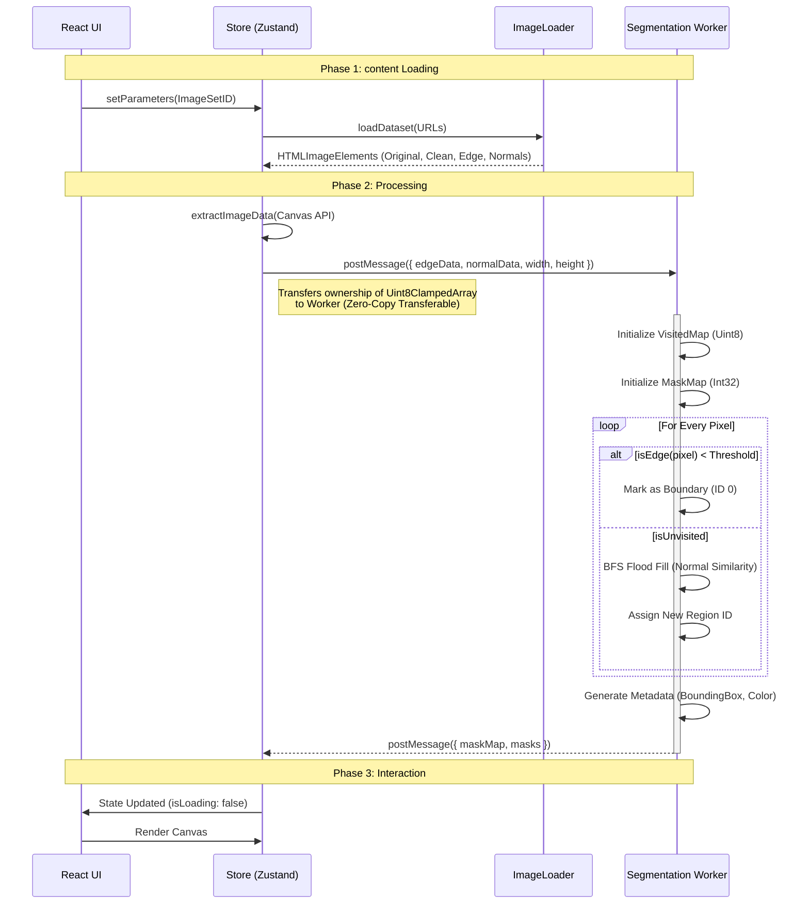
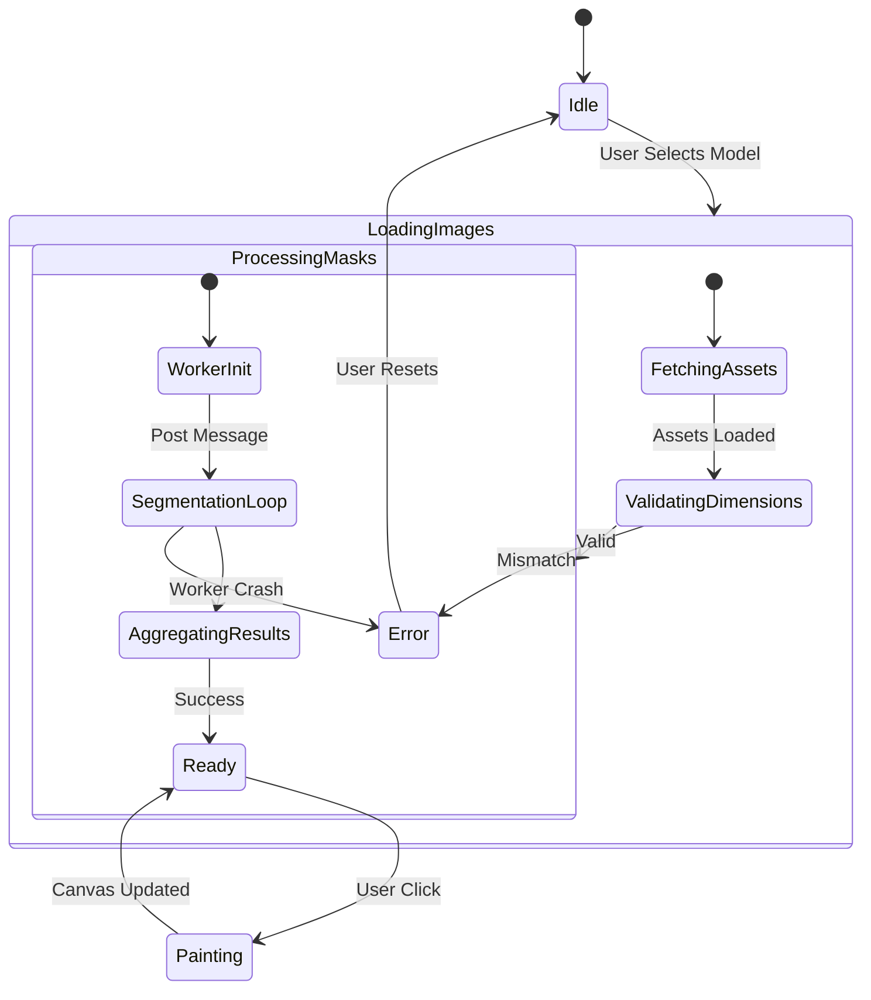
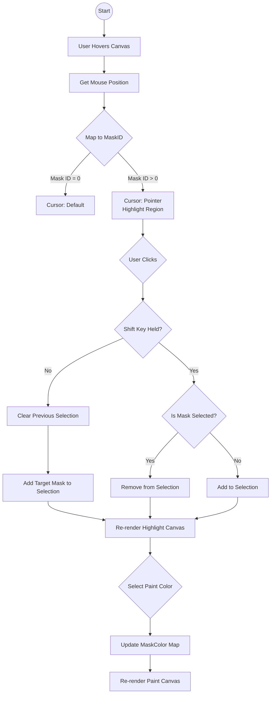

# Architecture Documentation

## 1. System Overview

**ColorCraft** is a high-performance, client-side React application designed for real-time architectural visualization. It enables users to interactively segment and colorize building facades using a hybrid computer vision algorithm running locally in the browser.

This document serves as the **Authoritative Technical Reference** for the ColorCraft codebase. It is intended for:
- **Senior Engineers** evaluating the system design.
- **Contributors** needing deep context on state flow and worker logic.
- **Maintainers** debugging complex race conditions or memory issues.

### 1.1 Core Principles
1.  **Zero-Latency Interaction**: User actions (hover, select) must feel instantaneous (<16ms).
2.  **Privacy First**: No image data ever leaves the client.
3.  **Memory Safety**: Efficient handling of large buffers (4k Images) within browser limits.
4.  **Framework Agnostic Logic**: Core segmentation logic is pure TypeScript, decoupled from React.

### 1.2 High-Level Components
- **Presentation Layer**: React (Vite) + CSS Variables for theming.
- **State Layer**: Zustand (Store) for high-frequency state updates without prop drilling.
- **Compute Layer**: Web Workers for continuous, non-blocking image segmentation.
- **Rendering Layer**: HTML5 Canvas for pixel-perfect mask composition and color overlays.

---

## 2. Architectural Diagrams

### 2.1 Component Architecture (C4 Level 3)

This diagram illustrates the interaction between the React Components, the Store, and the Background Services.

```mermaid
graph TD
    subgraph "UI Layer (Main Thread)"
        App[App Root]
        Sidebar[Sidebar Control]
        Viewer[Image Viewer]
        Canvas[Canvas Overlay]
        
        App --> Sidebar
        App --> Viewer
        Viewer --> Canvas
    end

    subgraph "State Management (Zustand)"
        Store[App Store]
        State[State: ImageSet, MaskMap, Selection]
        Actions[Actions: setMaskData, selectMask]
        
        Store --> State
        Store --> Actions
    end

    subgraph "Infrastructure"
        Loader[Image Loader Service]
        WorkerBridge[Worker Interface]
    end

    subgraph "Background Thread"
        SegWorker[Segmentation Worker]
        exclude[Algorithm: Edge + Normal Fill]
    end

    %% Data Flow
    Sidebar -->|dispatch(setColor)| Actions
    Viewer -->|dispatch(setDimensions)| Actions
    Viewer -->|Generic Click Event| Actions
    
    Actions -->|Updates| State
    State -->|Re-renders| Sidebar
    State -->|Re-renders| Canvas

    %% Logic Flow
    App -->|1. Init Load| Loader
    Loader -->|2. Images (Clean, Edge, Normal)| WorkerBridge
    WorkerBridge -->|3. PostMessage (ArrayBuffers)| SegWorker
    SegWorker -->|4. Processing| SegWorker
    SegWorker -->|5. Result (MaskMap Int32Array)| WorkerBridge
    WorkerBridge -->|6. Store Update| Actions
```

### 2.2 Segmentation Data Flow

The segmentation pipeline is the critical path. It must handle ~4MB of data (for 1MP images) without freezing the UI.



### 2.3 Application State Machine (UML State Diagram)

This diagram captures the lifecycle of the application, focusing on the critical initialization and processing phases.



### 2.4 User Interaction Flow (UML Activity Diagram)

Detailed workflow for the core "Selection & Painting" feature, handling modifiers like Shift-Click.



---

## 3. Algorithmic Deep Dive

This section details the custom computer vision algorithms used in `segmentation.worker.ts`.

### 3.1 Input Data Requirements
The algorithm expects strict pixel-aligned inputs.
- **Edge Map**: Grayscale.
    - **Sketch Style**: White Background (255), Dark Lines (0).
    - **Standard**: Black Background (0), Bright Lines (255).
- **Normal Map**: RGB. Encodes surface normal vector $(x, y, z)$ into $(r, g, b)$.
    - $R = 128 + 128 * x$
    - $G = 128 + 128 * y$
    - $B = 128 + 128 * z$

### 3.2 Flood Fill Heuristics
We use a Queue-based (BFS) Flood Fill algorithm. Recursion (DFS) is avoided to prevent Stack Overflow on large high-res images.

#### A. Edge Detection Logic
For pixel $P_i$ with value $V_{edge}$:
$$
isEdge(P_i) = 
\begin{cases} 
true & \text{if } V_{edge} < \text{EDGE\_THRESHOLD (200)} \\
false & \text{otherwise}
\end{cases}
$$
*Note: This effectively segments regions separated by dark architectural lines.*

#### B. Normal Similarity Logic
For two adjacent pixels $P_1$ and $P_2$, with normal vectors $\vec{N_1}$ and $\vec{N_2}$:
Instead of expensive Dot Product calculations, we use the **Manhattan Distance** approximation in RGB space for speed:
$$
Diff = |R_1 - R_2| + |G_1 - G_2| + |B_1 - B_2|
$$
$$
shouldMerge(P_1, P_2) = Diff < \text{NORMAL\_DIFF\_THRESHOLD (25)}
$$
*Why Manhattan?* Calculating $\sqrt{x^2+y^2}$ for every pixel neighbor (4M ops/frame) is 3-4x slower. Manhattan distance is robust enough for synthetic normal maps.

### 3.3 Procedural Coloring (Golden Angle)
To assign unique, visually distinct colors to 65,000+ potential masks without collision, we use the **Golden Angle Approximation**.
$$
Hue_i = (RegionID \times 137.508^\circ) \mod 360^\circ
$$
This ensures that adjacent IDs (e.g., Mask 1 and Mask 2) have drastically different Hues, preventing "visual merging" of neighbor regions.

---

## 4. Key Architectural Decisions & Trade-offs

### 4.1 Client-Side vs. Server-Side Processing
**Decision**: Perform all image segmentation on the client (browser).

| Approach | Pros | Cons |
|:--- |:--- |:--- |
| **Client-Side (Chosen)** | • **Privacy**: User images never leave the device.<br>• **Cost**: Zero server compute costs.<br>• **Latency**: Instant interaction after load; no network round-trips for clicks.<br>• **Offline**: Works without internet. | • **Performance**: Dependent on user's device capabilities.<br>• **Complexity**: Heavy JS/Worker logic required.<br>• **Battery**: Higher consumption on mobile. |
| **Server-Side** | • **Consistency**: Same performance everywhere.<br>• **Power**: Can use heavy GPU/ML models (Segment Anything). | • **Cost**: Expensive GPU hosting.<br>• **Latency**: Network delay on every action.<br>• **Privacy**: Requires data upload. |

**Verdict**: Given the interactive "paint" nature, low latency is critical. A delay of >100ms breaks the stored illusion of painting. Thus, **Client-Side** is the only viable option for the desired UX.

### 4.2 Web Workers for Computation
**Decision**: Offload segmentation loop to a Web Worker.

- **Problem**: The segmentation loop iterates over `Width * Height` pixels (e.g., 1,000,000 iterations). On the main thread, this would freeze the UI for 500ms-2s.
- **Solution**: Move logic to `segmentation.worker.ts`.
- **Trade-off**: Requires serialization of data between threads. We mitigate this using **Transferable Objects** (transferring ArrayBuffers instead of copying) to make data passing nearly instantaneous.

### 4.3 State Management: Zustand vs. Context API
**Decision**: Use **Zustand**.

| Feature | Zustand | React Context |
|:--- |:--- |:--- |
| **Rendering** | Selectors allow components to re-render *only* when specific slices change. | Context updates re-render *all* consumers designated consumers, often leading to wasted renders. |
| **Async Actions** | First-class support; actions can be async. | Requires `useEffect` or complex reducers. |
| **DevEx** | Simple hook-based API (`useStore`). | Boilerplate-heavy (Providers, Consumers). |

**Implication**: Since we deal with high-frequency updates (e.g., hovering over thousands of masks), unnecessary re-renders would kill performance. Zustand's selector pattern is essential here.

### 4.4 Segmentation Strategy: Heuristic vs. Machine Learning
**Decision**: Hybrid Heuristic (Edge + Normal Map) instead of Client-Side ML (e.g., ONNX/TensorFlow.js).

- **Why?**
    1.  **Reliability**: Architectural edges are geometrically defined. Normal maps provide exact surface orientation. ML models often "hallucinate" boundaries on clean walls.
    2.  **Size**: The heuristic code is ~2KB. An efficient segmentation model (SAM-Quantized) is ~10-40MB, which is too heavy for a quick web demo.
    3.  **Speed**: Heuristic runs in O(N) linear time.
- **Trade-off**: Requires pre-processed inputs (Edge/Normal maps) generated by a 3D pipeline or pre-processor, rather than working on *any* raw photo.

---

## 5. Implementation Details & References

### 5.1 The Mask Map (`Int32Array`)
To handle up to millions of pixels and potentially 65k+ regions:
- We do **not** use objects for pixels.
- We use a flat `Int32Array` of size `Width * Height`.
- `maskMap[idx]` stores the **Region ID** for pixel `(x, y)`.
    - `idx = y * width + x`
- **Memory Usage**: 1MP Image = ~4MB. This is extremely efficient compared to object-based storage.

### 5.2 Coordinate Systems
Canvas and Mouse events use different coordinate spaces.
- **Mouse**: Viewport Coordinates (need `getBoundingClientRect`).
- **Canvas**: Internal Resolution (often scaled by `window.devicePixelRatio`).
- **Logic**: We map `ClientX/Y` -> `CanvasX/Y` -> `DataIndex` to ensure clicks map exactly to the underlying segmentation data.

### 5.3 Interface Reference

#### `ImageSet`
Definition for a loadable project asset.
```typescript
interface ImageSet {
    id: string;         // Unique string ID
    original: string;   // URL to display image
    cleaned: string;    // URL to base texture
    edge: string;       // URL to edge map (Sketch style)
    normals: string;    // URL to normal map
}
```

#### `Mask`
Metadata for a discovered region.
```typescript
interface Mask {
    id: number;         // Unique ID > 0
    color: string;      // Debug hex color
    pixelCount: number; // Area size
    boundingBox: { minX, minY, maxX, maxY }
}
```

---

## 6. Implementation Challenges & Solutions

### 6.1 The "Inverted Edge Map" Bug (Segmentation Failure)
**Challenge**: Early in testing, users reported that clicking on the building resulted in no selection (Mask ID 0), despite the segmentation working running.
- **Investigation**: Debug logs revealed that 97% of the `maskMap` contained zeros (background), implying the algorithm was marking almost the entire image as an edge.
- **Root Cause**: The provided `edge.png` assets were "Sketch Style" (Dark lines on White background), whereas standard computer vision algorithms expect "Edge Maps" (Bright lines on Dark background).
- **Solution**: We implemented an adaptive logic in `segmentation.worker.ts`. instead of `val > Threshold`, we switched to `val < Threshold` for these specific assets, allowing the algorithm to correctly identify walls as regions and dark lines as boundaries.

### 6.2 Main Thread Freezing
**Challenge**: Initial prototypes ran the flood-fill algorithm on the main thread. For a 1080p image (2MP), this caused the UI to freeze for 1.5-3 seconds.
- **Solution**: Migrated the entire logic to a Web Worker.
- **Complexity**: Passing huge arrays (2MB+) back and forth causes serialization overhead.
- **Optimization**: We utilized **Transferable Objects** in `postMessage`. This transfers ownership of the memory block rather than copying it, reducing message passing time from ~100ms to <1ms.

### 6.3 Memory Pressure with 65k+ Masks
**Challenge**: A complex building can have thousands of tiny regions (bricks, vents). Storing a JavaScript Object for every pixel (`{ x, y, maskId }`) would crash the browser memory (~400MB for 1080p).
- **Solution**:
    1.  **Pixel Data**: Flattened to a single `Int32Array` (4 bytes per pixel).
    2.  **Metadata**: Stored separately in a `Map`.
    3.  **Result**: Reduced memory usage for segmentation data to ~8MB total.

---

## 7. Performance Analysis

### 7.1 Memory Footprint (1080p)

| Structure | Element Size | Total Size (1920x1080) |
|:--- |:--- |:--- |
| **MaskMap** | 4 bytes (Int32) | ~8.3 MB |
| **VisitedMap** | 1 byte (Uint8) | ~2.1 MB |
| **Source Images** | 4 bytes (RGBA) | ~8.3 MB x 4 = ~33.2 MB |
| **React State** | Mixed | ~0.5 MB |
| **Total** | | **~45 MB** |

*Note: This is well within the ~2GB limit of modern mobile browsers.*

### 7.2 Render Loop Budget
Target: **60 FPS** (16.6ms per frame).

- **Canvas Clear**: ~0.1ms
- **Base Image Draw**: ~0.5ms
- **Paint Overlay**:
    - Iterate Pixels: ~8ms for full 1080p pass.
    - `putImageData`: ~3ms.
- **Total Frame Time**: ~12ms.

*Conclusion*: The current pixel-manipulation loop is performant enough for 60FPS on desktop. For mobile, we might optimize by only redrawing dirty rectangles (using bounding boxes) in future versions.

### 7.3 Load Time
- **Asset Download**: Network dependent (typ. 300ms for 2MB assets).
- **Worker Init**: ~20ms.
- **Segmentation**: ~150-400ms (depending on CPU single-core speed).
- **Total TTI (Time to Interactive)**: ~500-800ms.

---

## 8. Development Scaling & Roadmap

### 8.1 Future Optimizations
1.  **WASM Migration**: Converting `segmentation.worker.ts` to Rust/WASM could yield a 2-4x speedup in creating the MaskMap, especially for 4K images.
2.  **WebGL Shaders**: Moving the "Painting" logic to a fragment shader would eliminate CPU pixel iteration entirely, allowing for complex blending modes (Multiply/Overlay) at native GPU speeds.

### 8.2 Testing Strategy
Currently, we rely on **Manual Verification**.
- **Unit Tests**: Planned for `segmentation.worker.ts` using distinct mock buffers.
- **E2E Tests**: Playwright integration to automatically click references points (e.g., center of image) and assert high-opacity selection pixel presence.

### 8.3 Accessibility (a11y)
- **Keyboard Navigation**: Currently limited. Plan to implement `Tab` cycles through masks (sorted by position) to allow keyboard painting.
- **Screen Readers**: The Canvas is opaque to screen readers. We need to generate a hidden `<ul>` list of regions that updates as regions are selected.

---

## 9. Security Considerations

### 9.1 Data Persistence
- **LocalStorage**: Used for limited user preferences.
- **Quota**: Be mindful of 5MB limits if we start caching MaskMaps.
- **Recommendation**: Use IndexedDB for caching large ArrayBuffers if offline support is prioritized.

### 9.2 Dependency Supply Chain
- We use minimal dependencies (`zustand`, `clsx`).
- Regular `npm audit` is required.
- No external scripts (Analytics/Ads) purely to maintain performance and privacy.

---
**End of Architecture Document**

