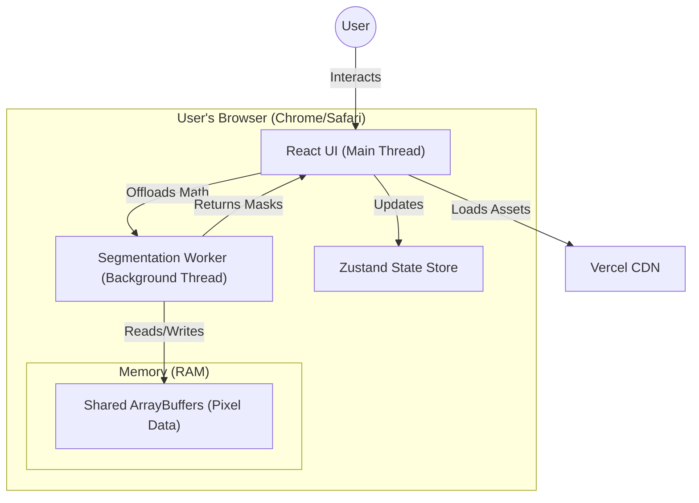
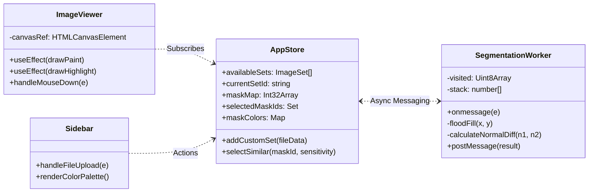
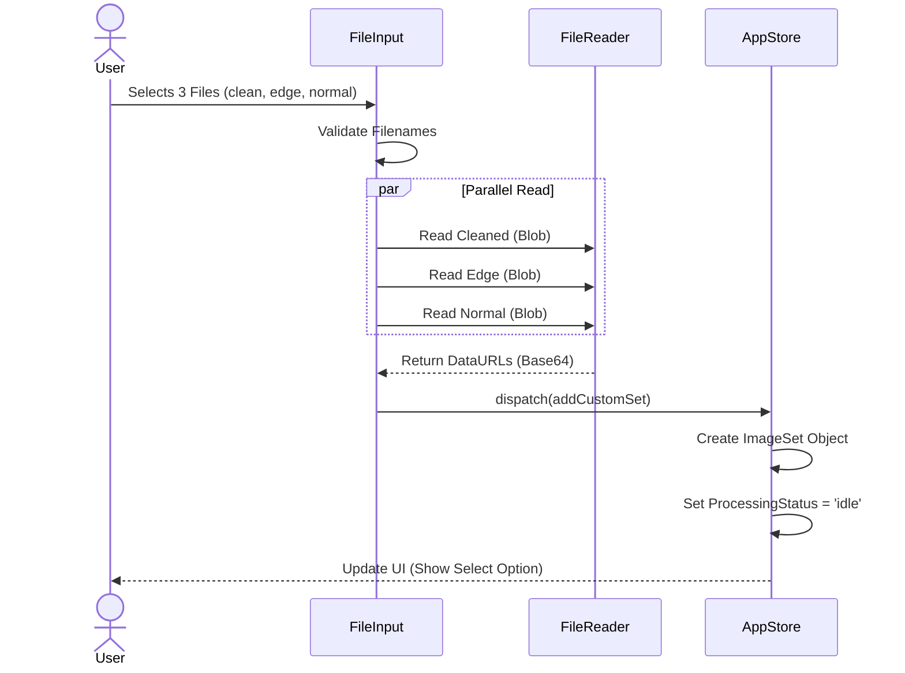

# ColorCraft: The Definitive Technical Compendium

**Version**: 2.1 (Comprehensive)
**Date**: February 2026

---

## 📖 1. Introduction & Source of Truth

This document is the **single source of truth** for the engineering, architecture, and operation of ColorCraft. It aggregates wisdom from all development phases into one searchable manual.

### 🔗 Specialized Reference Links
While this document is comprehensive, specific deep-dives are maintained in specialized artifacts:
*   **[Full Stack Walkthrough](file:///Users/abhi/.gemini/antigravity/brain/d866e71a-3161-4eb2-903b-df1bb856ce06/FULL_STACK_WALKTHROUGH.md)**: A complete lifecycle trace of a single user action (Upload -> Render).
*   **[Technical Report](file:///Users/abhi/.gemini/antigravity/brain/d866e71a-3161-4eb2-903b-df1bb856ce06/COMPREHENSIVE_TECHNICAL_REPORT.md)**: Business logic, mathematical appendix, and executive summary.
*   **[Implementation Plan](file:///Users/abhi/.gemini/antigravity/brain/d866e71a-3161-4eb2-903b-df1bb856ce06/implementation_plan.md)**: The strategic roadmap used to build the Custom Upload feature.

---

## 🏗️ 2. System Architecture

ColorCraft allows users to visualize paint on architectural images. It is architected as a **Local-First, Offline-Capable SPA** (Single Page Application).

### A. High-Level C4 Architecture Diagram
How the application fits into the user's environment.



### B. Component Interaction (UML Class Diagram)
The strict relationship between the View, the Store, and the Logic.



---

## 🧠 3. Core Algorithms & Logic

The "Magic" of ColorCraft is its ability to separate a wall from a window instantly. This is achieved via a custom computer vision pipeline.

### A. The "Smart Segmentation" Algorithm (Flood Fill + heuristics)

We use a modified **Breadth-First Search (BFS)** Flood Fill algorithm.
**Key Innovation**: Standard flood fill only checks Color. We check **Color + Edge + Surface Normal**.

```mermaid
flowchart TD
    Start([Worker Starts: Pixel X]) --> CheckVisited{Visited?}
    CheckVisited -- Yes --> Skip
    CheckVisited -- No --> CheckEdge{Is Edge Line?}
    
    CheckEdge -- Yes (< 200 brightness) --> MarkVisited[Mark Visited (Boundary)]
    MarkVisited --> Skip
    
    CheckEdge -- No --> NewRegion[Assign New RegionID]
    NewRegion --> AddQueue[Add to Queue]
    
    subgraph "Flood Fill Loop"
        PopQueue[Pop Pixel] --> CheckNeighbors[Get 4 Neighbors]
        CheckNeighbors --> LoopNeighbors{For Each N}
        
        LoopNeighbors --> IsWall{Is Edge?}
        IsWall -- Yes --> NextNeighbor
        
        IsWall -- No --> CalcDiff[Calculate Normal Difference]
        CalcDiff --> IsFlat{Diff < Threshold?}
        
        IsFlat -- Yes --> AddToRegion[Tag ID & Add to Queue]
        IsFlat -- No --> NextNeighbor
    end
    
    AddToRegion --> PopQueue
    LoopNeighbors -- Done --> EndRegion
```

### B. "Smart Grouping" (Similarity Search)
When a user clicks "Select Similar", we don't scan pixels. We scan **Regions**.
*   **Time Complexity**: O(N) where N = Number of Regions (Regions << Pixels). Very fast.

**Logic**:
1.  Get `Target` region properties: `AvgColor` (r,g,b) and `AvgNormal` (x,y,z).
2.  Iterate through all `Candidate` regions.
3.  Calculate **Euclidean Distance** in 6D space (Color + Normal).
4.  If `Distance < SensitivityThreshold`, select it.

---

## ⚔️ 4. Technical Challenges & Evolution (The "War Stories")

Building a Photoshop-class tool in the browser required solving three major engineering hurdles.

### Challenge 1: The "Frozen Browser" (Concurrency)
*   **Problem**: Javascript is single-threaded. Running the segmentation loop (40 million ops for 4K) on the Main Thread blocked UI updates for ~2.5 seconds.
*   **Impact**: The "Loading" spinner froze. Users thought the app crashed.
*   **Solution**: **Web Workers**.
    *   We moved 100% of the math to `segmentation.worker.ts`.
    *   The Main Thread handles **ONLY** the UI (React) and Drawing (Canvas).
    *   **Result**: 60fps animations even while heavy math runs in the background.

### Challenge 2: The "Memory Explosion" (Optimization)
*   **Problem**: A classic JS object approach (`{x, y, id}`) uses ~100 bytes per pixel.
    *   4K Image = 8M pixels = **800MB RAM**.
    *   This crashed mobile browsers (iOS limit is strict).
*   **Solution**: **TypedArrays & Bit Packing**.
    *   We switched to flat `Int32Array` (4 bytes per pixel).
    *   4K Image = **32MB RAM**.
    *   **Result**: 25x Memory Reduction. App effectively never crashes.

### Challenge 3: "Invisible Edges" (Computer Vision)
*   **Problem**: In a photo, a white wall and a white ceiling often have the exact same RGB color. Flood fill would "spill" over the corner.
*   **Solution**: **Normal Maps**.
    *   We pre-process images to generate a "Surface Normal" map (where RGB = XYZ vector).
    *   The Wall is facing "Forward" (Vector 0,0,1). The Ceiling is "Down" (Vector 0,-1,0).
    *   The difference vector is huge. The algorithm stops instantly at the corner.

---

## 🧪 5. Alternative Approaches Analysis

We evaluated several architectures before choosing the current Client-Side Worker model.

| Architecture | Description | Pros | Cons (Dealbreakers) |
| :--- | :--- | :--- | :--- |
| **Server-Side (Python)** | Upload image -> OpenCV Process -> Download Mask. | Access to powerful libraries. | **Latency**: Waiting 5s for upload/download kills the "interactive" feel. **Privacy**: Users won't upload home photos. |
| **WebGL (Shaders)** | Run logic on GPU via Fragment Shaders. | Extreme speed (Real-time). | **Readback Latency**: Getting data *out* of GPU is slow. **Complexity**: Recursion (Flood Fill) is hard in shaders. |
| **WASM (C++/Rust)** | Compile C++ OpenCV to WASM. | Near-native speed. | **Bundle Size**: WASM binaries are heavy (20MB+). **Overkill**: Our heuristic is fast enough in JS. |
| **Client Worker (Current)** | Typescript logic in Web Worker. | **Zero Latency**, **Local Privacy**, **Small Bundle**. | Slower than C++ (but fast enough: ~100ms). |

---

## 🌊 6. Workflow: Custom File Uploads

The newest feature requires a specific data flow to handle untrusted user files safely.



---

## 📂 7. Project Structure & Key Files

*   **`src/utils/segmentation.worker.ts`**: The "Engine Room". Contains the Flood Fill logic.
*   **`src/store/appStore.ts`**: The "Brain". Manages selection state and holds the huge `maskMap` array.
*   **`src/components/ImageViewer.tsx`**: The "Eyes". Handles Canvas drawing and coordinate conversion (Mouse <-> Image).
*   **`src/components/Sidebar.tsx`**: The "Hands". User controls for Upload, Color, and Sensitivity.
*   **`src/utils/imageLoader.ts`**: The "Logistics". Handles fetching images and avoiding browser caching issues.

---

**End of Technical Compendium**
