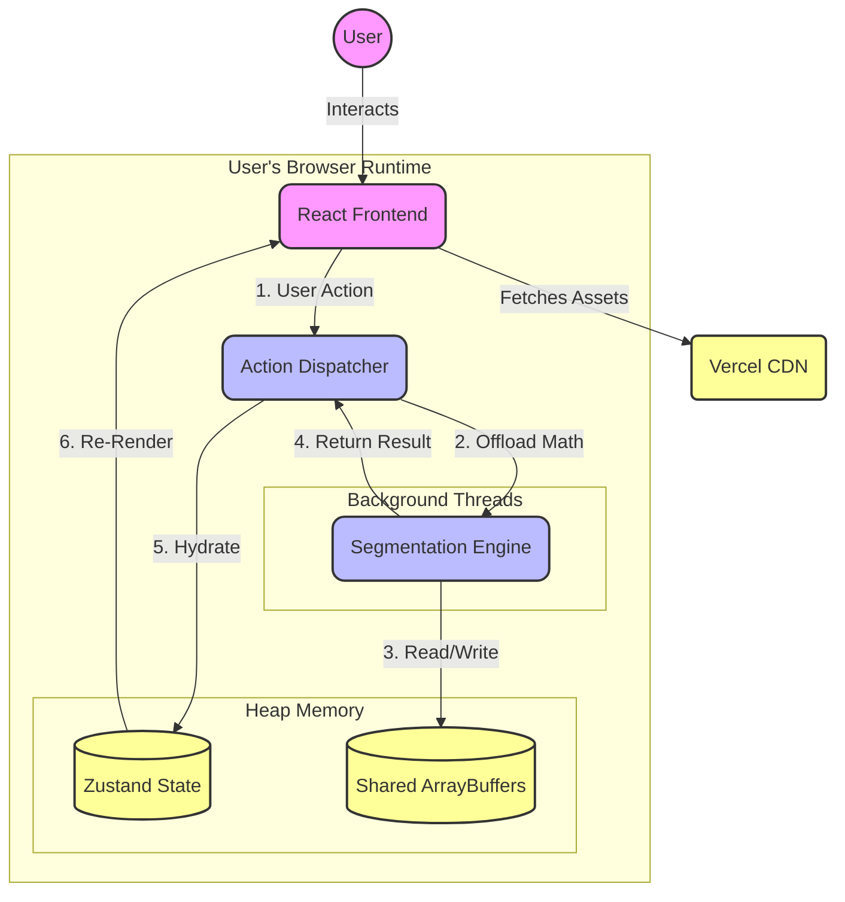
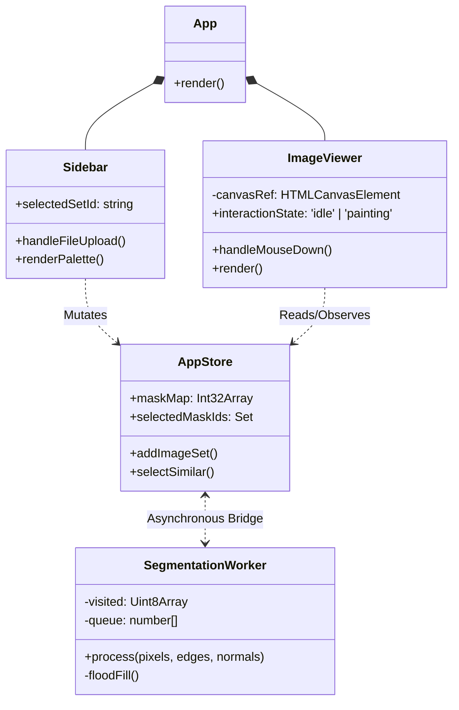
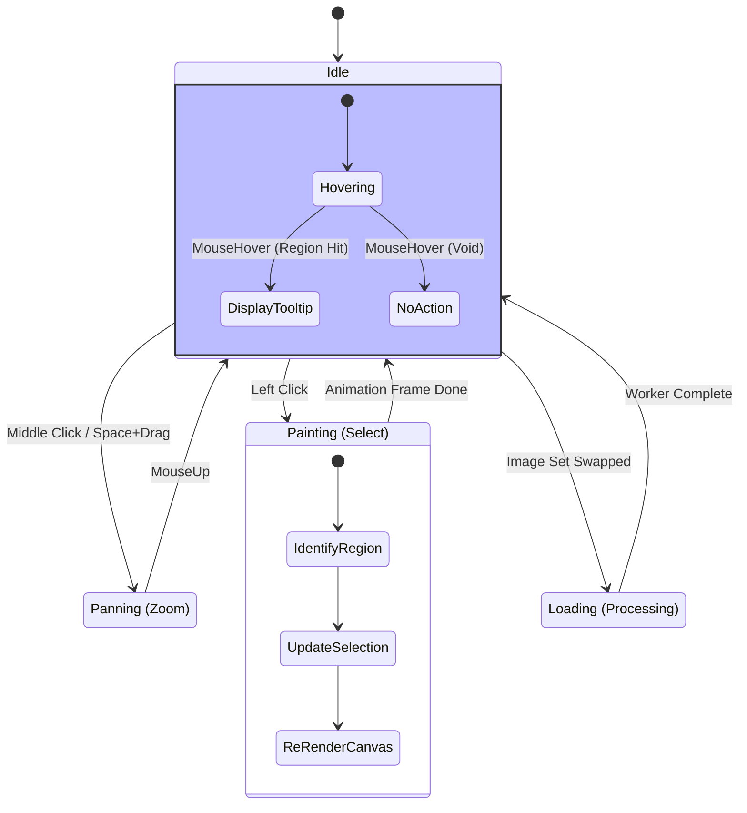
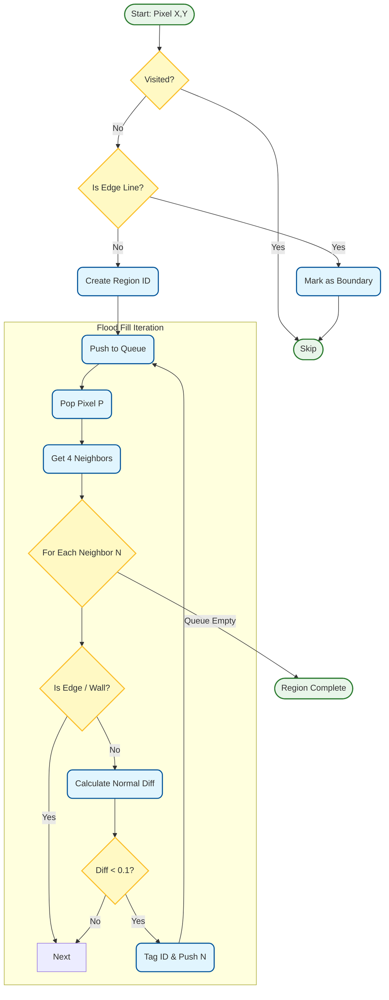
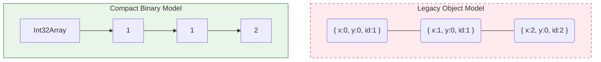
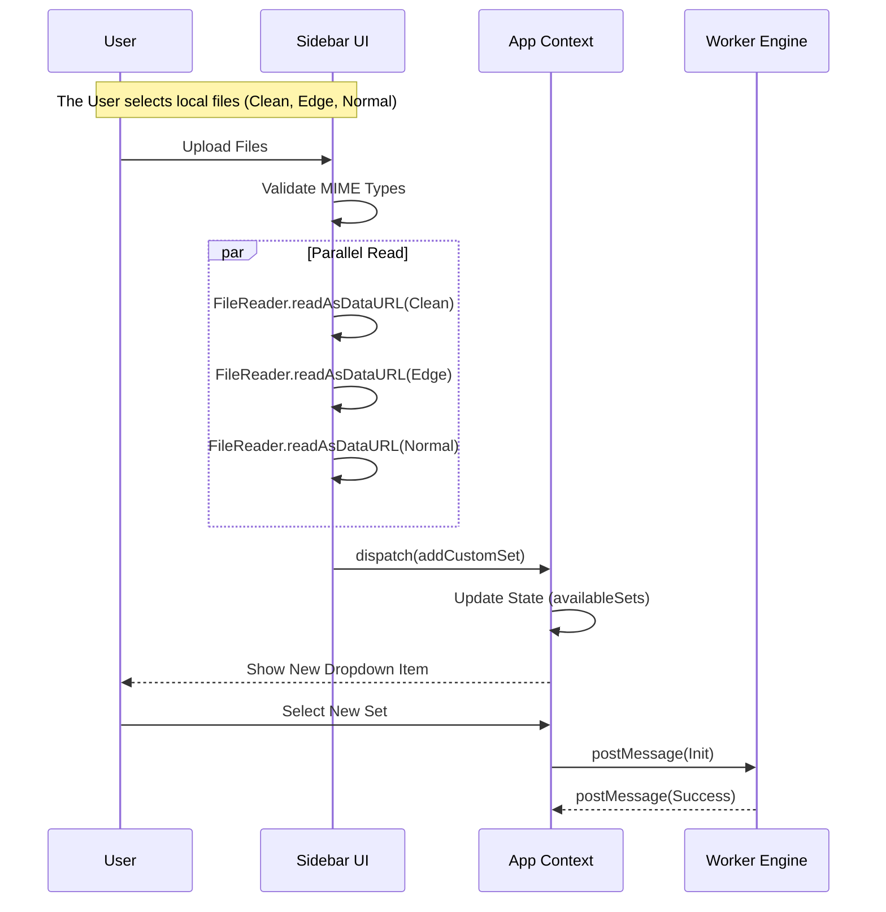

# ColorCraft: The Definitive Technical Compendium

**Version**: 3.1
**Date**: February 2026

---

## 📖 1. Executive Summary

ColorCraft is a high-performance, local-first Single Page Application (SPA) designed to solve a specific computer vision problem: **instant architectural segmentation in the browser**.

This document serves as the **comprehensive technical manual** for the system. It replaces all prior scattered documentation.

---

## 🏗️ 2. System Architecture

ColorCraft is a **Local-First, Offline-Capable SPA**. It relies on the "Thick Client" model, where the user's browser acts as the server.

### A. Context & Data Flow
*   **Rounded Edges**: Indicate Processes/Services.
*   **Cylinders**: Indicate Data Stores.

### B. UML Component Hierarchy
A strict breakdown of component responsibilities.

---

## 🖥️ 3. User Interaction State Machine

The application is modeless but state-dependent. The `ImageViewer` transitions between states based on input type (Mouse vs. Keyboard).

---

## 🧠 4. Algorithmic Core: Smart Segmentation

The "Heart" of ColorCraft. We use a modified **Breadth-First Search (BFS)** that traverses pixels based on a multi-factor heuristic.

**The Heuristic Function**:
$$ Cost(p_1, p_2) = \Delta Normal(p_1, p_2) + EdgePenalty(p_2) $$

### A. The Flood Fill Pipeline

---

## 💾 5. Memory Architecture

We utilize **TypedArrays** (Binary Buffers) to bypass JavaScript's Garbage Collector overhead.

### Comparison: Object vs. Binary

*   **Legacy**: ~200 bytes/pixel -> **800MB** (Mobile Crash).
*   **Adopted**: 4 bytes/pixel -> **32MB** (Stable).

---

## ⚔️ 6. Key Technical Challenges

### I. Concurrency (The Frozen Window)
*   **Issue**: Running 33 million comparison operations on the Main Thread blocked the Event Loop (~3000ms unresponsive).
*   **Fix**: **Web Workers**. We migrated all segmentation logic to `segmentation.worker.ts`.
*   **Result**: The UI remains interactive (60fps) even while the engine crunches a 4K image.

### II. The "Invisible Edge" (Wall vs Ceiling)
*   **Issue**: A white wall and a white ceiling share the same pixel color. Standard Flood Fill bleeds across the corner.
*   **Fix**: **Normal Maps**. We check the *surface angle*. Even if colors match, the normal relationship ($N_1 \cdot N_2 \approx 0$) reveals the corner.

---

## 🧪 7. Architectural Evolution (Discarded Prototypes)

We strictly document major prototypes that were implemented and then discarded.

### Prototype A: The "Legacy Main Thread"
*   **Approach**: React `useEffect` + Simple recursion.
*   **Result**: The browser froze for 3-5 seconds per click.
*   **Verdict**: **DISCARDED**. The UX was unacceptable.

### Prototype B: The "AI Experiment"
*   **Approach**: We integrated **Meta's SAM 2** (Segment Anything Model) via `onnxruntime-web`.
*   **Result**:
    1.  **Bloat**: The model weights added **20MB** to the download.
    2.  **Latency**: Inference took **4 seconds** on a laptop GPU.
    3.  **Accuracy (Fuzzy Masks)**: The AI produced *probability maps* (0.0 - 1.0). Thresholding these created "fuzzy" edges that looked bad when painted.
*   **Verdict**: **REVERTED**. We returned to the Heuristic (Flood Fill) engine because it produces **Watertight Hard Masks** (Integer IDs) instantly and with zero download size.

*Note: No other prototypes (e.g., native apps) were attempted in this repository.*

---

## 🌊 8. Workflow: Secure File Uploads

---

**End of Handbook**
